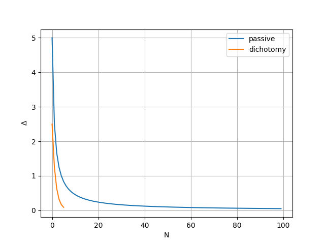
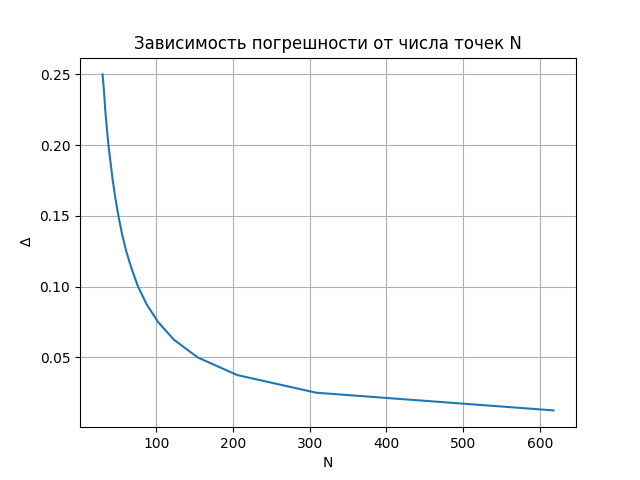
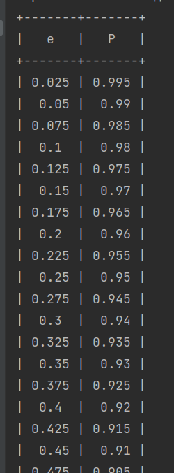
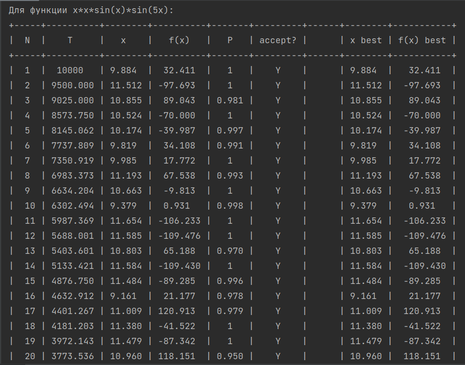
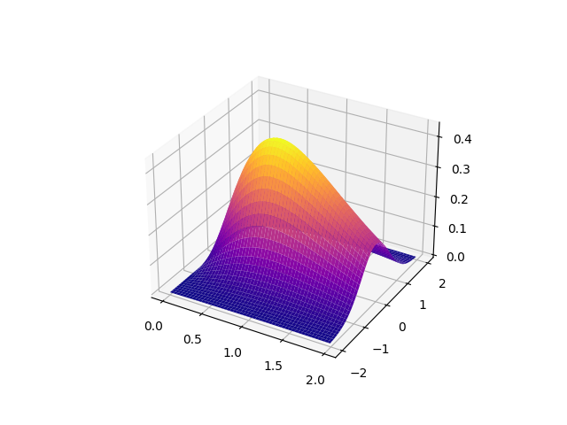
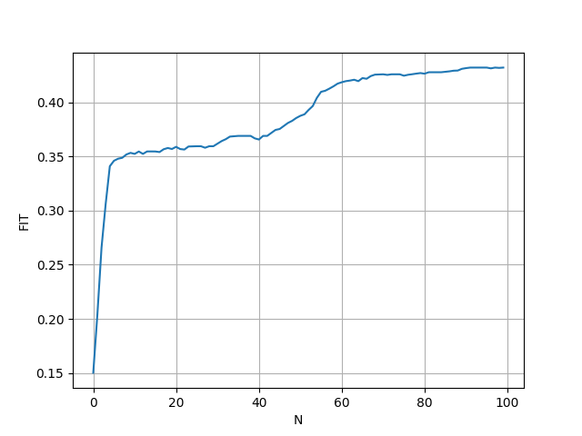
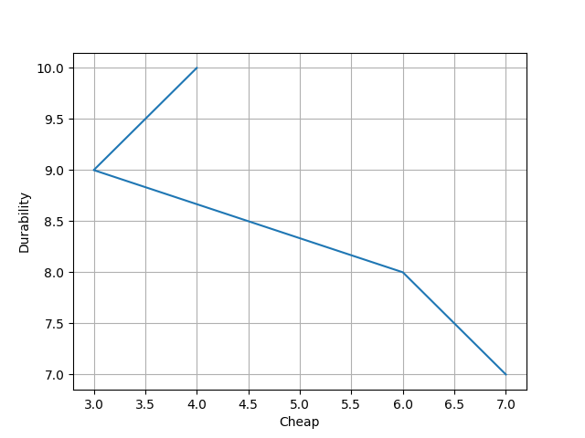
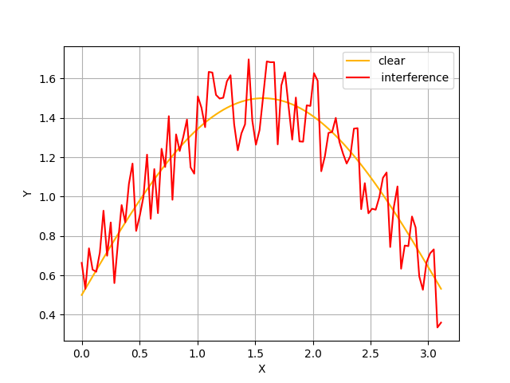
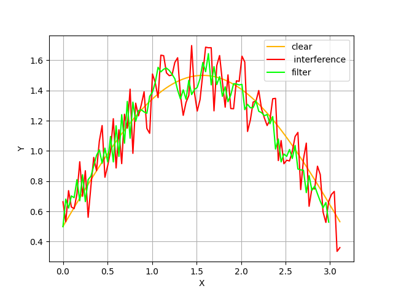

<h1>Системный анализ</h1>

<h3>LAB1 Dichotomy</h3>

<h3>LAB2 Random search method for extremal functions
one involved</h3>

<h3>LAB3 Investigation of the annealing simulation algorithm</h3>

<h3>LAB5 The study of genetic algorithms in the search for results
extremes</h3>

<h3>LAB6 Solution of the problem of multicriteria optimization</h3>

<h3>LAB7 Investigation of stochastic signal filtering as a task
two-criteria analytics using direct
passive search</h3>

